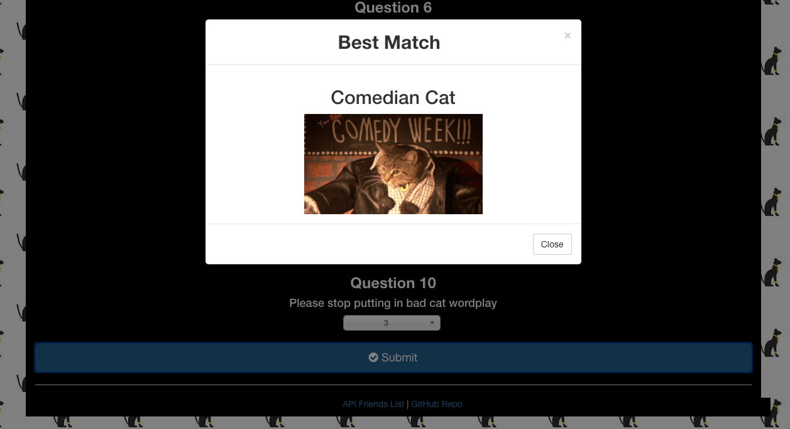

# CAT FINDER #

## Heroku link https://ancient-gorge-63389.herokuapp.com/ ##

## Overview ##
This is a full-stack app to not only help you find the cat of your dreams, BUUUUUT also to add yourself/your cat into the array of potential matches for future users.

## NPM's USED ## 
1. Express
2. Path
3. MySQL

## FUNCTIONALITY ##

When you open the app, you are given options to either 
1. Start the survey to discover which cat you are.
2. See the JSON data of cats. 
3. Go to my github to see the files.

Once you start the survey, you are required to input your name, a link to an image and finally answer 10 questions on a scale from 1-5.

If you don't answer everything, an alert will pop up asking you to fill in everything. Once you fill in the required fields, the app will match you with whatever cat answered closest to your answers.

